Solanaブロックチェーンホワイトペーパーの和訳（逐次訳）です。


# Solana: 高性能BlockChainのための新アーキテクチャ  v0.8.13

原本：https://solana.com/solana-whitepaper.pdf

著者: Anatoly Yakovenko

## 法的免責事項（Legal Disclaimer）

本ホワイトペーパーはトークンの販売を勧誘するものではなく、フィードバックの取得を目的として公開されています。将来的にトークンの販売を行う場合、最新版のホワイトペーパーと詳細な開示資料が提供され、その内容は本稿と大きく異なる可能性があります。将来予測に関する記述は、Solana の現時点の分析に基づくものであり、実際の結果と異なる場合があります。

## 概要（Abstract）

本稿は Proof of History (PoH) という概念に基づく新しいブロックチェーン・アーキテクチャを提案する。  
PoH はイベント間の順序と経過時間を検証するための「時間の証明」であり、改ざん不可能な台帳へと組み込まれる。  
PoH を Proof of Work や Proof of Stake と組み合わせることで、ビザンチン耐性を保ちつつメッセージ伝搬のオーバーヘッドを削減し、取引がほぼリアルタイム(1秒未満)で確定する。

さらに本稿では PoH の時間管理機能を活用した 2 つのアルゴリズム――

* 分割耐性を持つ PoS コンセンサス
* ストリーミング型 Proof of Replication (PoRep)

――を提示する。


PoH と PoRep の組み合わせにより、台帳の時間的順序とストレージに関する改ざんを防ぐことができる。  
1 Gbps ネットワーク上の解析では、今日入手可能なハードウェアで 710,000 TPS のスループットが可能であることを示す。

## 1. Introduction

ブロックチェーンは、フォールトトレラントなレプリケート・ステートマシン（耐障害性を備えた複製状態機械）の実装である。
現在公開されているブロックチェーンは、時間に依存していないか、参加者が時刻を保持できるという弱い仮定に基づいている<a href="#ref-04">［4, 5］</a>。
ネットワーク内の各ノードは通常、自身のローカルクロックに依存しており、ネットワーク内の他の参加者のクロックについては把握していない。

信頼できる時間の情報源が存在しないため、あるメッセージのタイムスタンプに基づいてそのメッセージを受け入れるか拒否する判断を下す場合でも、ネットワーク内のすべての参加者がまったく同じ判断を下す保証はない。

本稿で提案する PoH（Proof of History）は、イベント間の経過時間やメッセージの順序といった 時間の経過を検証可能な台帳 を作成することを目的として設計されている。
この台帳に記録された時間の経過に、ネットワーク内のすべてのノードが 信頼に依存せずに 拠ることができるようになることが想定されている。


## 2. Outline

本稿の残りの部分は、以下のように構成されている。  

* 第3章：全体のシステム設計を説明。  
* 第4章：Proof of History（PoH） の詳細な説明。  
* 第5章：提案する Proof of Stake コンセンサス・アルゴリズム の詳細について説明。 
* 第6章：提案する 高速な Proof of Replication（PoRep） の詳細について説明。 
* 第7章：システムアーキテクチャと性能の上限 についての分析。

* 第7.5章：高性能かつGPUフレンドリーなスマートコントラクト・エンジンの記述する。

## 3. Network Design

図1に示すように、任意の時点において、システム内のノードのうちの1つが リーダー（Leader） に指定され、Proof of History（PoH）列を生成する役割を担う。  
これにより、ネットワーク全体に対して一貫した読み取り（グローバル・リード・コンシステンシー）と検証可能な時間の経過が提供される。

リーダーはユーザーメッセージを逐次的に並べ、他のノードが効率的に処理できるように順序付けを行うことで、スループット（処理能力）を最大化する。

リーダーは、RAMに保持されている現在の状態（ステート）に対してトランザクションを実行し、そのトランザクションと最終状態の署名を、「ベリファイア（Verifiers）」と呼ばれる複製ノードに公開する。

ベリファイアは、自身が保持する状態のコピーに対して同じトランザクションを実行し、結果として得られた状態に対する署名を 確認情報（confirmations） として公開する。

このようにして公開された確認情報は、コンセンサス・アルゴリズムにおける投票（votes） として機能する。

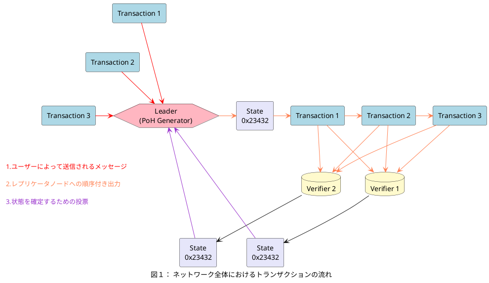


ネットワークが分断されていない状態（非分断状態）では、任意の時点においてネットワーク内には1つのリーダーが存在する。  
各ベリファイア（Verifier）ノードはリーダーと同じハードウェア能力を備えており、PoS（Proof of Stake）に基づく選挙によってリーダーに選出される可能性がある。  
この提案されたPoSアルゴリズムにおける選挙の仕組みは、第5.6節において詳しく解説する。

CAP定理の観点では、ネットワークが分断された場合には、一貫性（Consistency）が可用性（Availability）よりも優先されることがほとんどである。  
本稿では、大規模なネットワーク分断が発生した場合でも、いかなる規模のパーティションからでもネットワークの制御を回復するためのメカニズムを提案する。  
このメカニズムについては、第5.12節において詳しく解説する。

## 4 Proof of History

Proof of History（PoH）とは、2つのイベント間における時間の経過を暗号学的に検証できる方法を提供する一連の計算処理である。
この仕組みは、入力から出力を予測できず出力を得るには関数全体を完全に実行しなければならないような暗号学的に安全な関数が使用される。

この関数は、1つのコア上で逐次的に実行され、前回の出力を次の入力として用いる。関数は定期的にその出力と、呼び出された回数（カウント）を記録する。

その出力は、外部のコンピュータが各シーケンスの断片を別々のコアで検証することで、並列的に再計算・検証が可能である。

このシーケンス内にデータをタイムスタンプとして組み込むには、そのデータ（またはデータのハッシュ）を関数の状態に付加することで実現される。

関数の状態・インデックス・追加されたデータを記録することで、そのデータが次のハッシュがシーケンス内で生成される以前のある時点で確かに存在していたことが保証される、タイムスタンプが得られる。

この設計は 水平方向のスケーリングもサポートしており、複数の PoH 生成器が互いの状態をそれぞれのシーケンスに混ぜ合わせることで同期することができる。
この 水平スケーリング については、第4.4節にて詳しく説明する。

### 4.1 Description

本システムは、次のような手順で動作するように設計されている。  
暗号学的ハッシュ関数（たとえば `sha256` や `ripemd` など）のうち、関数を実行しない限り出力を予測できない関数を用いて、あるランダムな初期値から関数を実行し、その出力を次の入力として再び同じ関数に渡す。

この関数が呼び出された回数と、各回の出力を記録していく。

最初に選ばれるランダムな値は、任意の文字列でかまわず、たとえばその日のニューヨーク・タイムズ紙の見出しといったものでも良い。

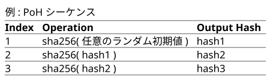

ここで、hashN は実際のハッシュ出力を表す。  
hash1、hash2、hash3 …

すべてのハッシュとインデックスを逐一公開する必要はなく、一定の間隔でその一部を公開するだけで十分である。

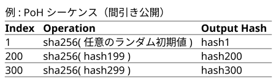

使用するハッシュ関数が 衝突耐性（collision resistant）を持っている限り、このハッシュの集合は、単一のコンピュータスレッドによって順番にしか計算できない。

これは、初期値からアルゴリズムを300回実行しなければ、インデックス`300`におけるハッシュ値を予測する方法が存在しないという事実に基づいている。

したがって、インデックス`0`からインデックス`300`の間にリアルタイム（実時間）が経過していることを、このデータ構造から推測することができる。

図2の例では、

* ハッシュ `62f51643c1` はカウント `510144806912` で生成され、
* ハッシュ `c43d862d88` はカウント `510146904064` で生成された。

先に述べた PoH アルゴリズムの性質に従えば、カウント`510144806912`から`510146904064`の間には、
確かにリアルタイムの経過があったと信頼できる。

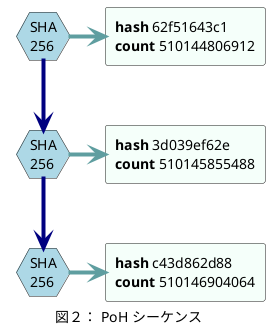

### 4.2 Timestamp for Events

このハッシュの連鎖列は、あるデータが特定のハッシュインデックスが生成される以前に作成されたことを記録するためにも使用できる。

その方法としては、「結合関数（combine function）」を使って、データを現在のインデックスにおけるハッシュと組み合わせる。
このデータとは、任意のイベントデータから得られる 暗号学的に一意なハッシュ であればよい。

結合関数は、単純にデータを付加（append）する処理でもよいし、衝突耐性のある任意の操作でもよい。

その後に生成されるハッシュは、そのデータに対するタイムスタンプを表している。
なぜなら、そのハッシュは、その特定のデータが挿入された後にしか生成され得ないからである。

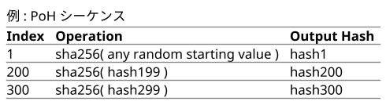

何らかの外部イベントが発生する。たとえば、写真が撮影されたり、任意のデジタルデータが作成されたりする。

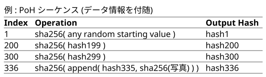

`hash336` は、`hash335` と写真の `sha256` を結合したバイナリデータから計算される。  
インデックスと写真の `sha256` は、シーケンス出力の一部として記録される。  
したがって、このシーケンスを検証する任意の者は、この変更をシーケンス上で再現することができる。  
検証は依然として並列で行うことができ、この点は第4.3節で議論する。  
初期の処理が依然として逐次的であるため、シーケンスに挿入された内容は、将来のハッシュ値が計算される前のある時点で発生していたことがわかる。

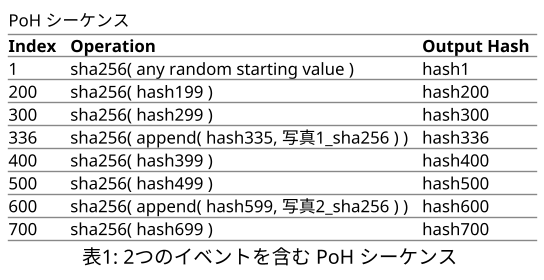

表1で表されるシーケンスにおいて、`写真2` は `hash600` より前に作成され、`写真1` は `hash336` より前に作成された。  
データをハッシュ列に挿入すると、その後のすべての値が変更される。  
使用されているハッシュ関数が衝突耐性を持ち、かつデータが追加されたものである限り、
どのデータがシーケンスに統合されるかという事前の知識に基づいて、将来のシーケンスをあらかじめ計算することは計算上不可能であるべきである。

シーケンスに混入されるデータは、生のデータそのものでもよいし、データのハッシュとそれに付随するメタデータでもよい。
**図3** の例では、入力 `cfd40df8...` が Proof of History のシーケンスに挿入された。  
それが挿入されたカウントは `510145855488` であり、そのときの状態は `3d039eef3` である。  
この変更により、その後に生成されるすべてのハッシュが変更され、この変更は図中の色の変化で示されている。  
このシーケンスを観測しているすべてのノードは、すべてのイベントが挿入された順序を判断でき、
それぞれの挿入の間にどれだけの実時間が経過したかを推定することができる。

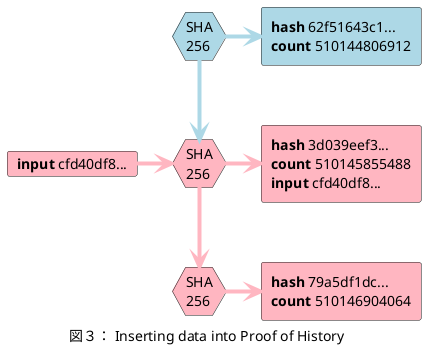

### 4.3 Verification

このシーケンスは、マルチコアコンピュータによって、生成にかかった時間よりも大幅に短い時間で正しく検証されることができる。

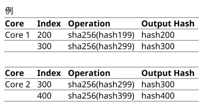

一定数のコアが与えられている場合、たとえば 4000 コアを持つ現代の GPU のような場合、  
検証者（verifier）は、ハッシュ列とそのインデックスを 4000 のスライスに分割し、  
それぞれのスライスが開始ハッシュからそのスライス内の最後のハッシュまで正しいことを  
並列に確認することができる。

このとき、シーケンスの生成に要する想定時間は次のようになる：

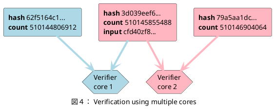
<code>総ハッシュ数 ÷ 1コアあたりの毎秒ハッシュ数</code>

シーケンスが正しいことを検証するために必要な想定時間は次のようになる：

<code>検証時間 = 総ハッシュ数 ÷ (1コアあたりの毎秒ハッシュ数 × 利用可能なコア数)</code>


図4の例では、各コアがシーケンスの各スライスを並列に検証することができる。  
すべての入力文字列は、付加されたときのカウンターおよび状態とともに出力に記録されているため、
検証者（verifiers）はそれぞれのスライスを並列に再現することができる。  
赤色で示されたハッシュは、シーケンスがデータ挿入によって変更されたことを表している。

### 4.4 Horizontal Scaling

複数の Proof of History 生成器を同期させることは可能であり、
それぞれの生成器のシーケンス状態を他の生成器と混合することで、
Proof of History 生成器の水平方向のスケーリングを実現することができる。  

このスケーリングはシャーディングを用いることなく行われる。  
システム内のイベントの完全な順序を再構築するためには、両方の生成器の出力が必要である。

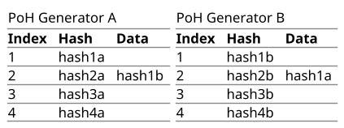

ジェネレーター A および B があるとき、A は B からデータパケット（`hash1b`）を受信する。
このパケットには、B の最後の状態と、B が観測した A の最後の状態が含まれている。
A における次の状態ハッシュは B の状態に依存するため、`hash1b` は `hash3a` より前に発生したことが導き出される。  

この性質は推移的であり、たとえばジェネレーター A を介して B および C が同期されている場合、
B と C が直接同期されていなくても、A 経由で A–C 間の依存関係を追跡することができる。

ジェネレーターを定期的に同期させることで、各ジェネレーターは外部トラフィックの一部を処理できるようになり、
全体としてより多くのイベントを追跡可能となる。
ただし、これはジェネレーター間のネットワーク遅延により真の時間精度を犠牲にすることになる。

グローバルな順序付けは、同期ウィンドウ内にあるイベント同士を何らかの決定論的関数、
たとえばハッシュ値そのものの大きさによって並べることで、依然として達成可能である。

**図5** では、2つのジェネレーターが互いの出力状態を挿入し、その操作を記録している。
色の変化は、ピアからのデータによってシーケンスが変更されたことを示している。
ストリームに混合された生成ハッシュは 太字 で示されている。
この同期は推移的であり、A–C 間のイベント順序を B を通して証明できる。

このようなスケーリングは可用性のコストを伴う。
たとえば、10 本の 1Gbps 接続がそれぞれ 0.999 の可用性を持つ場合、
システム全体の可用性は `0.999^10 = 0.99` となる。

### 4.5 Consistency

ユーザーは、生成されたシーケンスの一貫性を強制し、それを攻撃に対して耐性のあるものにすることが期待されている。  
その方法として、ユーザーは自分が正当とみなすシーケンスの最後に観測された出力を、
自らの入力に挿入することができる。

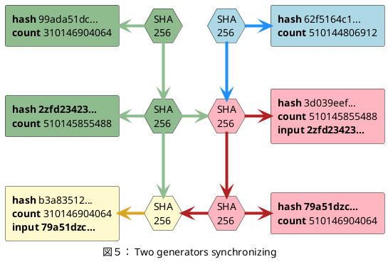

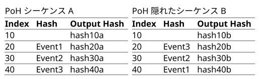

悪意のある PoH 生成器は、すべてのイベントに一度にアクセスできる場合や、より高速な隠れたシーケンスを生成できる場合、イベントの順序を逆にした第二の隠れたシーケンスを作成することが可能である。

この攻撃を防ぐために、各クライアントが生成するイベントには、
そのクライアントが正当とみなすシーケンスから最後に観測したハッシュを
イベントの中に含めるべきである。

つまり、クライアントが `Event1` のデータを作成する際には、
自身が最後に観測したハッシュを付加しておく必要がある。

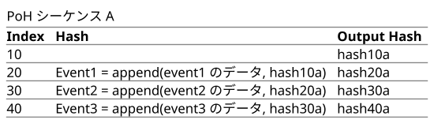
シーケンスが公開されると、`Event3` は `hash30a` を参照していることになる。  
もしこのハッシュが `Event3` よりも前のシーケンス内に存在しない場合、
そのシーケンスは無効なものであると、シーケンスの利用者は判断できる。

このとき、部分的な並べ替え攻撃（partial reordering attack）が可能なのは、
クライアントがイベントを観測してからそのイベントがシーケンスに挿入されるまでの間に
生成されたハッシュの数に限定される。

したがって、クライアントは、最後に観測したハッシュと挿入されたハッシュの間の短期間 においては、
順序が正しいとは限らないという前提で動作するソフトウェアを実装すべきである。

また、悪意のある PoH 生成器がクライアントのイベントハッシュを書き換えるのを防ぐために、
クライアントは単にデータを提出するのではなく、
イベントデータと最後に観測したハッシュを含めて署名したものを提出することができる。

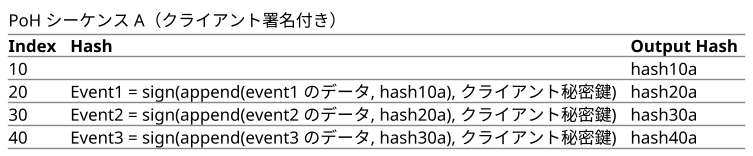

このデータの検証には、署名の検証と、
このイベントよりも前にあるシーケンス内のハッシュの検索が必要となる。

検証手順：
- Verify: (Signature, PublicKey, hash30a, event3 のデータ) = Event3
- Verify(Signature, PublicKey, Event3)
- Lookup(hash30a, PoHSequence)

**図6** では、ユーザーが提供した入力は、`0xdeadbeef...` というハッシュが生成されたシーケンス内に、  
挿入される以前のどこかの時点で存在していたことに依存している。

左上の青い矢印は、クライアントが以前に生成されたハッシュを参照していることを示している。  
このクライアントのメッセージは、`0xdeadbeef...` を含むシーケンス内でのみ有効である。

シーケンス中の赤色は、クライアントのデータによってシーケンスが変更されたことを示している。

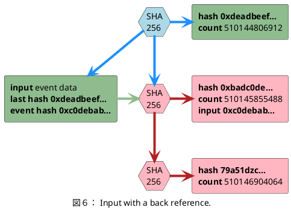

### 4.6 Overhead
毎秒 `4000` ハッシュを生成すると、追加で約 `160KByte` のデータが生成される。  
これを検証するには、`4000` コアを持つ GPU へのアクセスと、おおよそ `0.25〜0.75` ミリ秒 の時間が必要となる。


### 4.7 Attacks

#### 4.7.1 Reversal

悪意のある順序の逆生成（リバースオーダー）を行うには、攻撃者は2つ目のイベントの後から悪意あるシーケンスを開始する必要がある。
この遅延によって、悪意のないピアツーピアノードが元の順序について通信する時間的余裕が生まれる。

#### 4.7.2 Speed

複数の生成器（ジェネレーター）を持つことは、攻撃への耐性を高めたデプロイメントを可能にする。
1つの生成器は高帯域であり、多数のイベントを自身のシーケンスに混合できる。もう1つの生成器は高速かつ低帯域であり、高帯域生成器と定期的に混合を行う。

この高速シーケンスは、攻撃者が逆生成しなければならない第二のシーケンスを作り出す。

### 4.7.3 ロングレンジ攻撃

ロングレンジ攻撃とは、破棄された古いクライアント秘密鍵を取得し、偽の台帳（ledger）を生成する攻撃である<a href="#ref-10">[10]</a>。

Proof of History（PoH）は、こうしたロングレンジ攻撃に対して一定の防御を提供する。

悪意あるユーザーが古い秘密鍵にアクセスできたとしても、
偽造しようとする元の台帳と同じ時間をかけて記録を再生成しなければならない。
つまり、ネットワークが現在使用しているよりも高速なプロセッサを使用しない限り、過去の履歴に追いつくことはできない。

さらに、単一の時間源が存在することによりより単純な Proof of Replication（PoRep）の構築が可能になる。（詳細は第6章参照）

ネットワークは、すべての参加者が単一の履歴記録を信頼するように設計されているため、PoRep と PoH を組み合わせることで、偽造台帳に対して空間と時間の両面から防御を提供できる。

## 5 Proof of Stake Consensus

### 5.1 説明

この特定の Proof of Stake の実装は、以下の目的のために設計されている：

* Proof of History 生成器によって生成された現在のシーケンスを迅速に確定すること
* 次の Proof of History 生成器を投票で選出すること
* 不正行為を行ったバリデーターを処罰すること

このアルゴリズムは、すべての参加ノードにメッセージがある一定のタイムアウト以内に最終的に到達することに依存している。

### 5.2 用語

<dl>
    <dt>ボンド/証拠資金（bonds）</dt>
    <dd>
    ボンドは、Proof of Work における資本支出に相当する。
    PoW においてマイナーがハードウェアや電力に投資し、1つの分岐にコミットするのと同様に、
    PoS においてはバリデーターがトランザクションを検証している間、担保としてコインをロックする。
    </dd>
    <dt>スラッシング（slashing）</dt>
    <dd>
    これは、PoS システムにおける「何も賭けない問題（nothing-at-stake）」に対する提案された解決策である<a href="#ref-07">[7]</a>。
    異なる分岐に対する投票の証拠が公開された場合、その分岐は該当バリデーターのボンドを破棄することができる。これは、バリデーターが複数の分岐を確認しないようにするための経済的インセンティブである。
    </dd>
    <dt>スーパーマジョリティ（super majority）</dt>
    <dd>
    スーパーマジョリティとは、ボンドの重みによって評価されたバリデーターの 3分の2である。
    スーパーマジョリティによる投票は、ネットワークがコンセンサスに達したことを示す。
    このとき、もしこの分岐が無効であったとすれば、ネットワークの少なくとも3分の1が悪意を持って投票していたことになる。これは、攻撃にかかる経済コストがコインの時価総額の3分の1に相当することを意味する。
    </dd>
</dl>

### 5.3 担保(Bonding)
 
ボンディング・トランザクション（bonding transaction）は、
ある量のコインをユーザーのアイデンティティに紐づけられたボンディング・アカウントに移動させる。
ボンディング・アカウント内のコインは使用することができず、
ユーザーが削除するまでそのアカウントに留まらなければならない。
ユーザーはタイムアウトした古いコイン（stale coins）のみを削除することができる。
ボンドは、現在のステークホルダーのスーパーマジョリティによってシーケンスが確認された後に有効となる。

### 5.4 投票(Voting)

Proof of History 生成器は、あらかじめ定義された周期で状態（state）の署名を公開できることが期待されている。
各ボンド済みのアイデンティティ（bonded identity）は、その署名に対して、
自らの署名付き署名（signed signature）を公開することで確認（confirm）しなければならない。

この投票は 単純な「賛成（yes）」のみの投票であり、「反対（no）」は存在しない。タイムアウトの範囲内において、ボンド済みアイデンティティのスーパーマジョリティ（2/3以上）が投票した場合、
そのブランチは有効なものとして受け入れられる。


### 5.5 担保解除(Unbonding)

`N` 回の投票を欠席すると、そのコインは stale（期限切れ） とみなされ、投票資格を失う。  
ユーザーは、それらのコインを削除するためにアンボンディングトランザクション（unbonding transaction） を発行できる。
`N` は、stale な投票とアクティブな投票の比率に基づいて決まる動的な値である。

stale 投票の数が増えるにつれて、`N` も増加する。
大規模なネットワーク分断が発生した場合、この仕組みにより、より大きな分岐の方が小さな分岐よりも早く回復できる。


### 5.6 選挙(Elections)

PoH 生成器の選挙は、PoH 生成器の障害が検出されたときに発生する。  
最も大きな投票権を持つバリデーター、または同点の場合は最も高い公開鍵アドレスを持つバリデーターが、新たな PoH 生成器として選出される。

新しいシーケンスには、スーパーマジョリティ（2/3以上）の確認（confirmations）が必要である。
もし新たなリーダーがスーパーマジョリティの確認を得る前に失敗した場合、次に投票力が高いバリデーターが選出され、新たな確認セットが必要となる。

投票を切り替える（vote switching）には、バリデーターがより高い PoH シーケンスカウンターで投票し、新しい投票には切り替えたい投票内容が含まれていなければならない。そうでない場合、2回目の投票はスラッシャブル（罰則対象）となる。

投票切り替えは、スーパーマジョリティがまだ成立していない高さでのみ行えるように設計されることが想定されている。PoH 生成器が確定した後は、セカンダリ（Secondary）が選出され、トランザクション処理の役割を引き継ぐことができる。

セカンダリが存在する場合は、プライマリが失敗した際の次のリーダーとして扱われる。  
このプラットフォームは、例外が検出されたときや、あらかじめ定義されたスケジュールに従って、セカンダリがプライマリへと昇格し、下位の生成器が順に昇格していくように設計されている。

### 5.7 選挙の契機(Election Triggers)
#### 5.7.1 Forked Proof of History generator
PoH 生成器は、生成されたシーケンスに署名するためのアイデンティティを持つように設計されている。  
フォークが発生するのは、PoH 生成器のアイデンティティが侵害された場合に限られる。

フォークは、同じ PoH アイデンティティから2つの異なる履歴（歴史的記録）が公開されたことで検出される。

#### 5.7.2 Runtime Exceptions
ハードウェアの故障、バグ、または PoH 生成器による意図的なエラーによって、無効な状態（invalid state）が生成され、
その状態に対して ローカルバリデーターの結果と一致しない署名が公開される可能性がある。

この場合、バリデーターは 正しい署名をゴシップ（gossip）ネットワーク経由で公開し、このイベントは 新たな選挙ラウンドを開始するトリガーとなる。

無効な状態を受け入れたバリデーターは、ボンドをスラッシュ（slashing）される。

#### 5.7.3 Network Timeouts
ネットワークタイムアウトが発生すると、選挙（election）がトリガーされる。

### 5.8 Slashing
スラッシング（Slashing）は、バリデーターが2つの異なるシーケンスに投票した場合に発生する。
悪意ある投票の証明（proof of malicious vote）が提示されると、ボンドされたコインは流通から除外され、マイニングプールに追加される。
ただし、競合するシーケンスに対する過去の投票を含む新たな投票については、悪意ある投票の証明としては無効である。
この場合、ボンドはスラッシュされず、現在投じられている競合シーケンスへの投票が無効化される。

また、PoH 生成器が生成した無効なハッシュに対して投票が行われた場合もスラッシングが発生する。
PoH 生成器は、ランダムに無効な状態（invalid state）を生成することが期待されており、この場合はセカンダリ（Secondary）へのフォールバックがトリガーされる。

### 5.9 Secondary Elections

セカンダリおよび下位ランクの Proof of History 生成器は、提案（proposal）され、承認されることができる。  

この提案は、プライマリ生成器のシーケンス上で発行される。
提案にはタイムアウトが含まれており、もしこの期限内にスーパーマジョリティの投票によって承認された場合、
そのセカンダリは選出されたものと見なされ、予定されたとおりに役割を引き継ぐ。

プライマリは、次のいずれかの方法でソフトハンドオーバーを実施できる：

* 生成されたシーケンスに「ハンドオーバーが行われる」ことを示すメッセージを挿入する  
* 無効な状態（invalid state）を挿入して、ネットワークにセカンダリへのフォールバックを強制する

セカンダリが選出されており、プライマリが故障した場合、そのセカンダリは、選挙における第一のフォールバック候補として扱われる。

### 5.10 可用性（Availability）

パーティションを扱う CAP システムは、一貫性（Consistency）と可用性（Availability）のいずれかを選択しなければならない。本システムのアプローチでは、最終的には可用性（Availability）を選択するが、
客観的な時間の指標を持っているため、人間の感覚で妥当なタイムアウトの範囲内で一貫性（Consistency）も維持される。

Proof of Stake（PoS）検証者（verifiers）は、一定量のコインをステーク（ロック）することで、
特定のトランザクション集合に対して投票する権利を持つ。

コインをロックする操作も、他のトランザクションと同様に、PoH ストリーム内にトランザクションとして記録される。

PoS 検証者が投票するには、すべてのトランザクションを特定位置まで処理した後に得られた状態のハッシュに署名する必要がある。この投票もまた、トランザクションとして PoH ストリームに記録される。

PoH レジャーを参照することで、各投票の間にどれだけの時間が経過したかを推測できる。
また、パーティションが発生した場合に、各検証者がどれだけの間ネットワークに不在だったかも判定できる。

人間の時間感覚に適したパーティション対処法として、利用不能な検証者をアンステークする動的な手法を提案する。

<dl>
    <dt>検証者数が高く 2/3 を超えている場合</dt>
    <dd>
        アンステーキングは高速で行われる。
        少ない数のハッシュ生成で、不在の検証者のステークが完全にアンステークされ、
        コンセンサスの計算から除外される。
    </dd>
    <dt>検証者数が 2/3 未満だが 1/2 を超えている場合</dt>
    <dd>
        アンステーキングタイマーは遅くなり、アンステークが完了するまでにより多くのハッシュ生成が必要となる。
    </dd>
    <dt>1/2 以上の検証者が不在という大規模なパーティションの場合</dt>
    <dd>
        アンステーキングプロセスは極めて遅くなる。  
        トランザクションは引き続きストリームに挿入可能であり、検証者は投票もできるが、  
        2/3 の完全なコンセンサスには、非常に大量のハッシュ生成と、  
        不在検証者のアンステーク完了が必要となる。
    </dd>
</dl>

ネットワークが再びリブネス（liveness）を回復するまでの時間差が生じることで、ネットワークの利用者は人間の時間スケールで、自分が使い続けたいパーティションを選択することが可能となる。

### 5.11 Recovery

本システムにおいては、台帳（レジャー）はいかなる障害からでも完全に復旧可能である。

つまり、世界中の誰でも台帳内の任意の地点を選び、  
新たに生成したハッシュとトランザクションを付加することで、  
有効なフォークを作成することができる。

ただし、そのフォークに検証者（verifiers）が1人も存在しない場合、
新たなボンドが有効になり、そのブランチが2/3 のスーパーマジョリティコンセンサスを達成するには、
非常に長い時間がかかる。

つまり、利用可能な検証者がゼロの状態から完全復旧を行うには、非常に大量のハッシュを台帳に追加する必要がある。

そして、すべての不在検証者がアンステークされた後に限り、新たにステークされたボンドが台帳を検証できるようになる。

### 5.12 Finality
PoH は、ネットワーク上の検証者（verifiers）が過去に何が起きたかを観測できるようにする。  
このとき、各イベントの発生時刻についても、ある程度の確実性を持って把握できる。

PoH 生成器がメッセージのストリームを生成している間、すべての検証者は 500 ミリ秒以内に状態（state）に対する署名を提出する必要がある。この時間は、ネットワーク状況に応じてさらに短縮することも可能である。

各検証者の検証（verification）は PoH ストリームに記録されるため、ネットワーク上の誰もが、投票行動を直接観測せずとも、すべての検証者が所定のタイムアウト内に投票を行ったかを検証できる。

### 5.13 攻撃（Attacks）
#### 5.13.1 Tragedy of Commons
PoS 検証者（verifiers）は、PoH 生成器によって生成された状態ハッシュを単に確認（confirm）する。  
このとき、すべての状態ハッシュを無条件に承認することで作業を回避しようとする経済的インセンティブが発生する可能性がある。

この状況を防ぐために、PoH 生成器はランダムな間隔で無効なハッシュを挿入すべきである。  
その無効なハッシュに投票した検証者は、スラッシュ（slashing）される。

無効なハッシュが生成された場合、ネットワークは即座にセカンダリ（Secondary）として選出されていた PoH 生成器を昇格させる必要がある。

各検証者は、短いタイムアウト（たとえば 500ms）以内に応答することが要求される。  
このタイムアウトは、悪意のある検証者が他の検証者の投票を観測してから自分の投票をストリームに間に合わせる確率を低くするように設定されるべきである。

#### 5.13.2 Collusion with the PoH generator
PoH 生成器と共謀している検証者（verifier）は、無効なハッシュがいつ生成されるかを事前に知っており、そのハッシュには投票しない可能性がある。

このシナリオは、実質的にはPoH のアイデンティティがより大きな検証者ステークを保有している場合とほとんど違いがない。

たとえそうであっても、PoH 生成器は状態ハッシュを生成するためのすべての作業を行う必要がある。

#### 5.13.3 Censorship

検閲（Censorship）や サービス拒否（Denial of Service） は、
ボンド保有者の 1/3 が、新しいボンドを含むシーケンスの検証を拒否した場合に発生しうる。

この種の攻撃に対して、プロトコルは以下の方法で防御することができる：

* ボンドが stale（期限切れ）になる速度を動的に調整することで対抗する。

サービス拒否攻撃が発生した場合、より大きなパーティション（ネットワーク分割）はフォークを行い、
ビザンチン的なボンド保有者を検閲する設計となっている。

その後、時間の経過とともにビザンチンボンドが stale になることで、大きなネットワークは回復し、スーパーマジョリティを取り戻す。

一方、小さなビザンチン側パーティションは、長期間にわたり前進できない状態に置かれる。

このアルゴリズムの流れは次の通り：

1. ネットワークの過半数が新しいリーダーを選出する。
1. 選出されたリーダーは、ビザンチンなボンド保有者の参加を検閲する。
1. PoH 生成器は連続してシーケンスを生成し続けることで、時間の経過を証明する。
1. それにより、十分な数のビザンチンボンドが stale となるまで時間を稼ぐ。
1. 大きなネットワーク側がスーパーマジョリティを達成する。

ボンドが stale になる速度は、アクティブなボンドの割合に基づいて動的に決定される。  
そのため、ビザンチン側のマイノリティフォークは、スーパーマジョリティの回復により長い時間を要することになる。

スーパーマジョリティが確立された後、スラッシング（Slashing）によって、ビザンチンボンド保有者を恒久的に処罰することが可能となる。

#### 5.13.4 Long Range Attacks

PoH（Proof of History）は、ロングレンジ攻撃に対する自然な防御手段を提供する。

過去の任意の地点から台帳を復元しようとする場合、攻撃者は PoH 生成器の速度を上回って、正当な台帳を時間的に追い越す必要がある。

さらに、コンセンサスプロトコルは第二の防御層を提供する。というのも、いかなる攻撃も、すべての正当な検証者をアンステークさせるのにかかる時間よりも長くかかる必要があるためである。

この仕組みによって、台帳の履歴には可用性ギャップ（availability gap）が生じる。つまり、同じ高さの 2 つの台帳を比較する場合、最大分断（maximum partition）が最も小さい方が、客観的に正当なものとみなすことができる。

#### 5.13.5 ASIC Attacks

このプロトコルにおいて、ASIC 攻撃が成立する可能性のあるタイミングは 2 つ存在する：

<dl>
    <dt>パーティション発生時  (パーティション中の ASIC 攻撃)  </dt>
    <dd>
        パーティション発生時には、攻撃者が高速な ASIC を使って台帳のフォークを有利に進めることを試みる可能性がある。しかし、本プロトコルでは、ボンドがアンステークされる速度は非線形であり、ネットワークが大規模に分断されている場合、アンステークの進行は ASIC 攻撃で得られる想定利益よりも桁違いに遅い。
    </dd>
    <dt>ファイナリティ（最終確定）におけるタイムアウトの不正操作時  </dt>
    <dd>
        この脆弱性では、ビザンチンな（悪意ある）バリデーターがボンドを持ったまま他のノードからの確認を待ち、共謀する PoH 生成器と連携して投票を挿入することができる。
        PoH 生成器が高速な ASIC を用いれば、500ms 相当のハッシュをそれより短時間で生成でき、
        その間に PoH 生成器と協力ノード間で通信が成立してしまう可能性がある。
        だが、もし PoH 生成器自身もビザンチンであるならば、攻撃者はあらかじめいつ失敗を挿入するかのカウンターを共有しておくことができる。
        このシナリオは本質的に、PoH 生成器と協力ノードが同じアイデンティティとステークを持ち、
        1つのハードウェアセットを使って動作しているのと変わらない。
    </dd>
</dl>

## 6 Streaming Proof of Replication

### 6.1 Description
Filecoin は、Proof of Replication（PoRep）のあるバージョンを提案している<a href="#ref-06">[6]</a>。  
このバージョンの目的は、Proof of History によって生成されたシーケンス上で
時間を追跡することで、PoRep の検証を高速かつストリーミングで実行可能にすることである。

Replication はコンセンサスアルゴリズムとしては使用されないが、
ブロックチェーンの履歴や状態を高可用性で保存するコストを計上するための有用な手段として機能する。

### 6.2 Algorithm

図7に示されているように、CBC暗号（Cipher Block Chaining）は、
各データブロックを逐次的に暗号化し、直前の暗号化ブロックを使用して入力データに XOR を適用する。

各リプリケーション・アイデンティティ（replication identity）は、
Proof of History シーケンスで生成されたハッシュに署名することで鍵を生成する。  
これにより、鍵はリプリケータのアイデンティティと、特定の PoH シーケンスに結びつけられる。

選択できるハッシュは特定のものに限られる（詳細は セクション6.5「ハッシュの選択」を参照）。

データセットは、すべてのブロックを逐次的に完全に暗号化される。  
次に、証明（proof）を生成するために、生成した鍵を使って
疑似乱数生成器（pseudorandom number generator）にシードを与え、各ブロックからランダムに 32 バイトを選択する。

各スライスには、選択された PoH ハッシュを先頭に付加し、マークルハッシュ（Merkle hash）が計算される。  
このときのルート（Merkle root）と、使用された鍵、選択されたハッシュが公開される。

リプリケーションノードは、PoH 生成器によって N 個のハッシュが生成されるごとに、新たな証明を公開する必要がある。  
ここでの `N` は、データを暗号化するのにかかる時間の約 1/2 に相当する。

PoH 生成器は、PoRep（Proof of Replication）のための特定のハッシュをあらかじめ定義された周期で公開する。
リプリケータノードは、次に公開されるハッシュを選択して証明を生成しなければならない。

同様に、そのハッシュは署名され、各ブロックからランダムにスライスが選択され、マークルルートが作られる。

`N` 個の証明期間が過ぎた後、データは新しい CBC 鍵で再暗号化される。

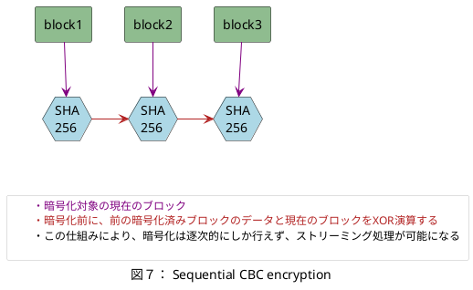

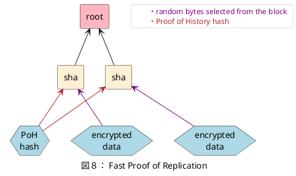

### 6.3 Verification

N 個のコアがある場合、各コアはそれぞれのリプリケーション・アイデンティティの暗号化処理をストリーミング実行できる。

必要な総ストレージ容量は `2 × ブロック数 × Nコア分`となる。
これは、次のブロックを暗号化するためには、前の暗号化済みブロックが必要であるためである。

各コアは、現在の暗号化ブロックから導かれるすべての証明（proof）を生成するために使用可能となる。

証明の検証にかかる時間は、暗号化にかかる時間とほぼ等しいと予測されている。

証明自体は、ブロックから少量のランダムバイトしか使用しないため、ハッシュ化するデータ量は暗号化ブロックサイズよりも大幅に少ない。

同時に検証可能なリプリケーション・アイデンティティの数は、利用可能なコア数に等しい。
現代の GPU は、3500 コア以上を搭載しており、そのクロックスピードは CPU のおよそ 1/2〜1/3 程度である。

### 6.4 キーのローテーション（Key Rotation）

キーのローテーションを行わない場合、  
同じ暗号化レプリケーションから、複数の Proof of History シーケンスに対して安価な証明（proof）を生成できてしまう可能性がある。

そのため、キーは定期的にローテーション（更新）され、  
各レプリケーションは、新たな Proof of History シーケンスに結びついた新しい鍵で再暗号化される。

ただし、ローテーションはGPU ハードウェア上での検証が現実的に可能となる程度に  
十分ゆっくり行う必要がある。  
これは、GPU は CPU よりもコア単体あたりの処理速度が遅いためである。

### 6.5 ハッシュの選択（Hash Selection）

Proof of History 生成器は、ネットワーク全体が使用するための ハッシュ値を公開する。  
このハッシュは、以下の目的で使用される：

- Proof of Replication を暗号化するための鍵  
- 高速な証明（fast proof）におけるバイト選択のための疑似乱数生成器のシード

このハッシュは、データセットの暗号化にかかる時間のおよそ1/2 に相当する周期ごとにPoH シーケンス上で公開される。

すべてのレプリケーション・アイデンティティは、この同じハッシュを使用し、署名されたハッシュの結果をシード（または暗号鍵）として利用する必要がある。

各リプリケータが証明を提出しなければならない周期（証明周期）は、暗号化にかかる時間よりも短く設定されなければならない。  
さもなければ、リプリケータは暗号化をストリーミング処理して、証明ごとにデータを削除することが可能になってしまう。

悪意ある PoH 生成器は、このハッシュより前に特定のデータをシーケンスに挿入することで、望んだハッシュを生成することができてしまう可能性がある。

この攻撃については、セクション 5.13.2 にてさらに詳しく議論されている。

### 6.6 証明の検証（Proof Validation）

Proof of History ノードは、提出された Proof of Replication の検証を行うことは想定されていない。  
その代わりに、PoH ノードは、各リプリケータのアイデンティティごとに、未検証の証明と検証済みの証明の件数を記録・管理することが期待されている。

ある証明（proof）は、ネットワーク内のスーパーマジョリティのバリデーターによって署名されたときに検証済みと見なされる。

この検証署名は、リプリケータが p2p ゴシップネットワークを介して収集し、ネットワーク内のスーパーマジョリティのバリデーターによる署名を含む1つのパケットとして提出される。

このパケットは、Proof of History シーケンスで生成された特定のハッシュ以前のすべての証明を検証済みとするものであり、複数のリプリケータのアイデンティティを同時に含めることができる。

### 6.7 Attacks
#### 6.7.1 スパム（Spam）

悪意あるユーザーは、多数のリプリケータ・アイデンティティを作成し、不正な証明（bad proofs）でネットワークにスパムを仕掛ける可能性がある。

これに対処するため、検証を要求する際には、各ノードが暗号化されたデータ全体とマークルツリー全体をネットワークに提供することが求められる。

本論文で設計されている Proof of Replication は、追加の証明に対して安価な検証が可能であり、追加のストレージを必要としない。

しかし、各アイデンティティは暗号化において 1 コア分の処理時間を消費するため、リプリケーションの対象（replication target）は、使用可能なコア数を上限として設定されるべきである。

現代の GPU には、3500コア以上が搭載されている。


#### 6.7.2 部分消去（Partial Erasure）

リプリケータノードは、状態全体を保存せずに済ませるために、一部のデータを意図的に消去（部分消去）しようとする可能性がある。
しかし、証明の回数とシードのランダム性によって、この攻撃は非常に困難になる。
たとえば、1テラバイトのデータを保持しているユーザーが、各 1メガバイトブロックから 1バイトだけを削除するとする。

このとき、各証明が 1 メガバイトごとに 1 バイトをサンプリングすると仮定すると、
削除されたバイトにヒットする確率は以下のように計算される：

* 1 回の証明で検出される確率：
  $1 - (1 - \cfrac{1}{1,000,000})^{1,000,000} \approx 0.63 $

* 5 回の証明を行った場合、少なくとも 1 回は検出される確率： $0.99$

したがって、ごくわずかな部分的な削除でも、複数回の証明によって高い確率で検出されることになる。

### 6.7.3 PoH 生成器との共謀（Collusion with PoH generator）

署名されたハッシュは、サンプル抽出（sample）に使用するシードとして利用されることが想定されている。
もしリプリケータが事前に特定のハッシュを選択できるとしたら、
サンプリング対象とならないすべてのバイトを消去することが可能になる。

PoH 生成器と共謀しているリプリケータ・アイデンティティは、ランダムバイト選択用に事前定義されたハッシュが生成される直前に、
シーケンスの末尾に特定のトランザクションを挿入することができる。

十分なコア数があれば、攻撃者はリプリケータにとって都合の良いハッシュを生成できる可能性がある。

ただし、この攻撃は単一のリプリケータ・アイデンティティのみに利益をもたらす。
すべてのアイデンティティは、同じ暗号学的に署名されたハッシュ（例：ECDSA）を使用する必要があり、
その署名は各リプリケータごとに一意で衝突耐性がある。

したがって、単一のリプリケータが得られる利益はごくわずかにとどまる。

#### 6.7.4 サービス拒否（Denial of Service）

新たなリプリケータ・アイデンティティを追加するコストは、ストレージコストと等しいと想定されている。
また、すべてのリプリケータ・アイデンティティを検証するために必要な計算能力のコストは、リプリケーションごとに CPU または GPU の 1 コア分に相当する。

このことにより、多数の有効なリプリケータ・アイデンティティを作成することでネットワークにサービス拒否（DoS）攻撃を仕掛ける機会が生じる可能性がある。

この攻撃を制限するために、ネットワークで選択されるコンセンサスプロトコルは、リプリケーション対象（replication target）を選定し、ネットワーク上での可用性、帯域幅、地理的位置（geolocation）などの望ましい特性を満たすリプリケーション証明に報酬を与えることができる。

#### 6.7.5 コモンズの悲劇（Tragedy of Commons）

PoS 検証者（verifiers）は、実際には何の作業も行わずに PoRep（Proof of Replication）を単に確認（confirm）してしまう可能性がある。

この問題を防ぐために、PoS 検証者が実際に作業を行うような経済的インセンティブを設計する必要がある。たとえば、マイニング報酬を PoS 検証者と PoRep のリプリケーションノードとで分配するなどが挙げられる。

このシナリオをさらに回避する手段として、PoRep 検証者自身が一定の確率で「偽の証明（false proof）」を意図的に提出することが考えられる。そして、その偽の証明が偽であることを、データを生成した関数を示すことで証明する。

このとき、偽の証明を承認してしまった PoS 検証者はスラッシュ（slashing）の対象となる。

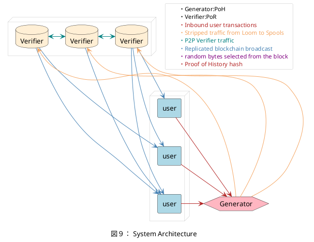

## 7 System Architecture
### 7.1 Components

#### 7.1.1 リーダー（Leader）, Proof of History 生成器

リーダーとは、選出された Proof of History（PoH）生成器である。

リーダーは、任意のユーザートランザクションを受け取り、それらすべてのトランザクションに対してユニークでグローバルな順序を保証するPoH シーケンスを出力する。
各トランザクションのバッチ処理の後、リーダーは その順序でトランザクションを実行した結果得られる状態（state）の署名を出力する。この署名は、リーダーのアイデンティティで署名される。


#### 7.1.2 状態（State）

状態は、ユーザーのアドレスをインデックスとした単純なハッシュテーブル（naive hash table） として構成されている。
各セル（cell）には、完全なユーザーアドレスと、この計算に必要なメモリが格納される。

たとえば、トランザクションテーブル（Transaction table）には以下が含まれる：

**Transaction table contains :**
```
0                                159        223     255
┏━━━━━━━━━━━━━━━━━━━━━━━━━━━━━━━━━┳━━━━━━━━━━┳━━━━━━━━┓
┃ Ripemd of Users Public Key      ┃ Account  ┃ unused ┃
┗━━━━━━━━━━━━━━━━━━━━━━━━━━━━━━━━━┻━━━━━━━━━━┻━━━━━━━━┛
```
For a total of 32 bytes

**Proof of Stake bonds table contains :**

```
0               63               159        223     255
┏━━━━━━━━━━━━━━━━━━━━━━━━━━━━━━━━━┳━━━━━━━━━━┳━━━━━━━━┓
┃ Ripemd of Users Public Key      ┃ Account  ┃ unused ┃
┣━━━━━━━━━━━━━━━┳━━━━━━━━━━━━━━━━━┻━━━━━━━━━━┻━━━━━━━━┛
┃ Last Vote     ┃
┣━━━━━━━━━━━━━━━┻━━━━━━━━━━━━━━━━━━━━━━━━━━━━━━━━━━━━━┓
┃ unused                                              ┃
┗━━━━━━━━━━━━━━━━━━━━━━━━━━━━━━━━━━━━━━━━━━━━━━━━━━━━━┛
```
For a total of 64 bytes


#### 7.1.3 検証者（Verifier）, 状態のレプリケーション（State Replication）

検証者ノード（Verifier nodes）は、ブロックチェーンの状態をレプリケーションし、その高可用性（high availability）を提供する役割を担う。

レプリケーション対象（replication target）はコンセンサスアルゴリズムによって選定される。
また、コンセンサスアルゴリズム内のバリデーターたちは、オフチェーンで定義された基準に基づき、承認する Proof of Replication ノードを選定・投票する。

ネットワークは、次のような構成が可能である：

* Proof of Stake ボンドの最小額を設定する
* 各ボンドにつき、1つのリプリケータ・アイデンティティのみを許可する

#### 7.1.4 バリデーター（Validators）

これらのノードは、検証者（Verifiers）からの帯域（bandwidth）を消費する。
バリデーターは仮想ノード（virtual nodes）であり、以下のいずれの構成でも動作可能である：

* 検証者ノード（Verifiers）と同一のマシン上  
* リーダー（Leader）と同一のマシン上  
* または、このネットワークのコンセンサスアルゴリズム専用に構成された別のマシン上


## 7.2 ネットワークの限界（Network Limits）

リーダー（Leader）は、ユーザーからのパケットを受信し、最も効率的な方法で順序付けを行い、
それらを Proof of History シーケンスとして整列・発行することが期待されている。
この PoH シーケンスは、下流の検証者（Verifiers）へ公開される。

この「効率性」は、トランザクションのメモリアクセスパターンに基づいており、
トランザクションは以下を最大化・最小化するように並べられる：

* ページフォールトの最小化
* プリフェッチ（事前読み込み）の最大化

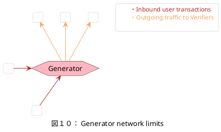

**受信パケットの形式 :**

```
0               63               159        223          255
┏━━━━━━━━━━━━━━━━━━━━━━━━━━━━━━━━━┳━━━━━━━━━━┳━━━━┳━━━━┓      ┓
┃ Last Valid Hash                 ┃ Counter  ┃ u  ┃ S  ┃      ┃
┣━━━━━━━━━━━━━━━┳━━━━━━━━━━━━━━━━━┻━━━━━━━━━━┻━━━━┻━━━━┛      ┃
┃ Fee           ┃                                             ┣ Signed
┣━━━━━━━━━━━━━━━┻━━━━━━━━━━━━━━━━━━━━━━━━━━━━━━━━━━━━━━━━━┓   ┃
┃ From                                                    ┃   ┃
┗━━━━━━━━━━━━━━━━━━━━━━━━━━━━━━━━━━━━━━━━━━━━━━━━━━━━━━━━━┛   ┛
┏━━━━━━━━━━━━━━━━━━━━━━━━━━━━━━━━━━━━━━━━━━━━━━━━━━━━━━━━━┓
┃ Signature 1 of 2                                        ┃
┣━━━━━━━━━━━━━━━━━━━━━━━━━━━━━━━━━━━━━━━━━━━━━━━━━━━━━━━━━┫
┃ Signature 2 of 2                                        ┃
┗━━━━━━━━━━━━━━━━━━━━━━━━━━━━━━━━━━━━━━━━━━━━━━━━━━━━━━━━━┛
```
Size 20 + 8 + 16 + 8 + 32 + 3232 = 148 bytes

**サポート可能な最小のペイロードは、1つの宛先アカウント（destination account）**

```
0            63           127    159        223          255
┏━━━━━━━━━━━━━━━━━━━━━━━━━━━━━━━━━┳━━━━━━━━━━┳━━━━┳━━━━┓
┃ Last Valid Hash                 ┃ Counter  ┃ u  ┃ S  ┃
┣━━━━━━━━━━━━━━━━━━━━━━━━━━━━━━━━━╋━━━━━━━━━━╋━━━━┻━━━━┛      ┓
┃ To                              ┃ Amount   ┃                ┃
┣━━━━━━━━━━━━━┳━━━━━━━━━━━━┳━━━━━━┻━━━━━━━━━━┛                ┃
┃ From        ┃            ┃                                  ┣ Signed
┣━━━━━━━━━━━━━┻━━━━━━━━━━━━┻━━━━━━━━━━━━━━━━━━━━━━━━━━━━━━━┓  ┃
┃ From                                                     ┃  ┃
┗━━━━━━━━━━━━━━━━━━━━━━━━━━━━━━━━━━━━━━━━━━━━━━━━━━━━━━━━━━┛  ┛
┏━━━━━━━━━━━━━━━━━━━━━━━━━━━━━━━━━━━━━━━━━━━━━━━━━━━━━━━━━┓
┃ Signature 1 of 2                                        ┃
┣━━━━━━━━━━━━━━━━━━━━━━━━━━━━━━━━━━━━━━━━━━━━━━━━━━━━━━━━━┫
┃ Signature 2 of 2                                        ┃
┗━━━━━━━━━━━━━━━━━━━━━━━━━━━━━━━━━━━━━━━━━━━━━━━━━━━━━━━━━┛
```
ペイロードの最小サイズ : 176 bytes

**Proof of History（PoH）シーケンスパケット**

以下の情報が含まれている：
* 現在のハッシュ（current hash）  
* カウンター（counter）  
* PoH シーケンスに追加されたすべての新しいメッセージのハッシュ  
* それらのメッセージを処理した後の状態署名（state signature）

このパケットは、N 個のメッセージがブロードキャストされるごとに 1 回送信される。

```
0            63           127    159        223          255
┏━━━━━━━━━━━━━━━━━━━━━━━━━━━━━━━━━┳━━━━━━━━━━┓
┃ Current Hash                    ┃ Counter  ┃
┣━━━━━━━━━━━━━━━━━━━━━━━━━━━━━━━━━╋━━━━━━━━━━┛                ┓
┃ Messages Hash                   ┃                           ┃
┣━━━━━━━━━━━━━━━━━━━━━━━━━━━━━━━━━┫                           ┣ Signed
┃ State Hash                      ┃                           ┃
┗━━━━━━━━━━━━━━━━━━━━━━━━━━━━━━━━━┛                           ┛
┏━━━━━━━━━━━━━━━━━━━━━━━━━━━━━━━━━━━━━━━━━━━━━━━━━━━━━━━━━┓
┃ Signature 1 of 2                                        ┃
┣━━━━━━━━━━━━━━━━━━━━━━━━━━━━━━━━━━━━━━━━━━━━━━━━━━━━━━━━━┫
┃ Signature 2 of 2                                        ┃
┗━━━━━━━━━━━━━━━━━━━━━━━━━━━━━━━━━━━━━━━━━━━━━━━━━━━━━━━━━┛
```
出力パケットの最小サイズ : 132 bytes

1Gbpsのネットワーク接続において、可能な最大トランザクション数は
1ギガビット毎秒 ÷ 176バイト = 最大約71万トランザクション毎秒（tps） となる。

イーサネットフレーミングの影響により、1〜4%の損失が生じることが予想される。

ネットワークの目標使用量を上回る余剰帯域は、Reed-Solomon符号で出力を符号化し、利用可能な下流の検証者（Verifiers）にストライピング（分散）して送信することで、可用性の向上に利用できる。

### 7.3 計算上の限界（Computational Limits）

各トランザクションには、ダイジェストの検証が必要となる。

この処理は、トランザクションメッセージ自体の外部メモリを使用せず、完全に独立して並列化できる。

したがって、スループットは主にシステムに搭載されたCPUコアの数によって制限されると考えられる。

GPUベースのECDSA検証サーバでは、1秒あたり90万件の検証処理という実験結果も報告されている。<a href="#ref-09">[9]</a>。

### 7.4 メモリの限界（Memory Limits）

状態を、各アカウントに対して32バイトのエントリを持つ、使用率50%のハッシュテーブルとして素朴に実装した場合、理論上は100億アカウントを640GBに格納可能である。

このテーブルへの定常状態でのランダムアクセス性能は、1秒あたり約1,100万回の読み書きとして測定された。

1トランザクションあたり2回の読み取りと2回の書き込みを行うと仮定すると、メモリのスループットとしては1秒あたり275万トランザクションの処理が可能である。

これらの測定は、Amazon Web Services上の1TBメモリを搭載した x1.16xlarge インスタンスで実施された。

### 7.5 高性能スマートコントラクト（High Performance Smart Contracts）

スマートコントラクトは、トランザクションの一般化された形である。
これらは各ノード上で実行され、状態を変更するプログラムである。

この設計では、拡張Berkeley Packet Filter（eBPF）のバイトコードをスマートコントラクトの言語として利用しており、高速で解析しやすく、JIT（実行時コンパイル）も可能である。

この方式の主な利点のひとつは、ゼロコストのFFI（外部関数インターフェース）を持つことである。
プラットフォーム上で直接実装されている関数（インストリンシック）は、プログラムから呼び出すことができる。

インストリンシックの呼び出しは、そのプログラムの実行を一時停止させ、高性能なサーバ上でインストリンシックをスケジューリングして実行する。
インストリンシックはバッチ処理され、GPU上で並列実行される。

上記の例では、異なる2つのユーザープログラムが同じインストリンシックを呼び出している。
各プログラムは、インストリンシックのバッチ実行が完了するまで一時停止される。

インストリンシックの一例としては、ECDSA署名の検証がある。
これらの呼び出しをGPUでバッチ処理することで、スループットは数千倍にまで向上する可能性がある。

```plantuml
@startuml
caption "図１１： Executing BPF programs."
<style>    
    card{
        BackGroundColor #Thistle
        LineThickness 1
    }
    rectangle {
        BackGroundColor #PapayaWhip
        LineThickness 1
    }
    circle {
        FontSize 12
        BackGroundColor transparent
        LineThickness 0
        LineColor black
        Margin 0
        Padding 0
    }
</style>

'Node
card "User program 1" as C1 {
    card "BPF 1" as BPF1 #LightBlue
    card "BPF 1\ncont..." as BPFC1 #LightBlue
}
card "User program 2" as C2{
    card "BPF 2" as BPF2 #LightBlue
    card "BPF 2\ncont..." as BPFC2 #LightBlue
}
rectangle "GPU Intrinsic Server" as R {
    portin i1
    portin o1
    rectangle "Intrinsic A" as INTR1 #LightBlue
    rectangle "Intrinsic A" as INTR2 #LightBlue
}

C1 -right[hidden]-> C2

BPF1 -right[hidden]-> BPFC1
BPF2 -left[hidden]-> BPFC2
INTR1 -right[hidden]-> INTR2


BPF1 -down-> i1 #FireBrick 
BPF2 -down-> i1 #FireBrick 

o1 --> BPFC1 #SteelBlue
o1 --> BPFC2 #SteelBlue

@enduml
```

この「トランポリン」処理は、OSのスレッドコンテキストスイッチを必要としない。
なぜなら、BPFバイトコードは使用するすべてのメモリに対して明確に定義されたコンテキストを持っているからである。

eBPFのバックエンドは2015年からLLVMに組み込まれており、任意のLLVMフロントエンド言語でスマートコントラクトを書くことができる。

また、eBPFは2015年以降Linuxカーネルにも搭載されており、最初のバイトコードは1992年から存在している。

eBPFは1パスで正当性の確認、実行時間とメモリ要件の把握、そしてx86命令への変換が可能である。

## References
<span id="ref-01">[1]</span> Liskov, Practical use of Clocks  
http://www.dainf.cefetpr.br/tacla/SDII/PracticalUseOfClocks.pdf

<span id="ref-02">[2]</span> Google Spanner TrueTime consistency  
https://cloud.google.com/spanner/docs/true-time-external-consistency

<span id="ref-03">[3]</span> Solving Agreement with Ordering Oracles  
http://www.inf.usi.ch/faculty/pedone/Paper/2002/2002EDCCb.pdf

<span id="ref-04">[4]</span> Tendermint: Consensus without Mining  
https://tendermint.com/static/docs/tendermint.pdf 

<span id="ref-05">[5]</span> Hedera: A Governing Council & Public Hashgraph Network  
https://s3.amazonaws.com/hedera-hashgraph/hh-whitepaper-v1.0-180313.pdf

<span id="ref-06">[6]</span> Filecoin, proof of replication,  
https://filecoin.io/proof-of-replication.pdf

<span id="ref-07">[7]</span> Slasher, A punative Proof of Stake algorithm  
https://blog.ethereum.org/2014/01/15/slasher-a-punitive-proof-of-stake-algorithm/

<span id="ref-08">[8]</span> BitShares Delegated Proof of Stake  
https://github.com/BitShares/bitshares/wiki/Delegated-Proof-of-Stake

<span id="ref-09">[9]</span> An E cient Elliptic Curve Cryptography Signature Server With GPU Acceleration  
http://ieeexplore.ieee.org/document/7555336/

<span id="ref-10">[10]</span> Casper the Friendly Finality Gadget  
https://arxiv.org/pdf/1710.09437.pdf
